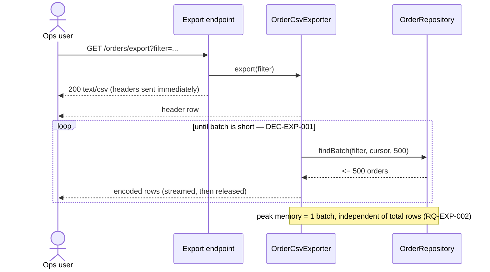

# Getting Started with AGNOS

One complete session, start to finish, on one small feature — so you can see what you type, what
the agent produces, and how the pieces stay wired together.

> **Precedence.** This guide illustrates the process; it does not define it.
> [`.github/instructions/agnos-sw-eng.v2.instructions.md`](.github/instructions/agnos-sw-eng.v2.instructions.md)
> is normative. Where the two disagree, the instruction file wins. Each stage below names the
> instruction section it illustrates so you can check it in one hop.

---

## Who does what

AGNOS is a two-role process. Knowing which role you are in at any moment is most of the skill.

| | You (human) | The agent |
|---|---|---|
| **Decides** | what to build, which trade-off wins, when a task is approved | how to implement an approved task |
| **Produces** | prompts, approvals, corrections | requirement files, ADRs, plans, code, commits |
| **Owns** | the *why* | the *how* |

You are not writing the artifacts. You are steering an agent that writes them, and reviewing what
comes back. Most of what follows is short prompts and short reviews.

---

## Before you start

1. **The repository is set up for your tool.** GitHub Copilot reads `.github/instructions/` and
   `.github/skills/` automatically. Claude Code reads the root `CLAUDE.md`, which imports the same
   instruction file. Nothing to configure.
2. **`process/` exists** with its four folders (`1.requirements/`, `2.architecture/`, `3.plan/`,
   `_sessionstate/`).
3. **You have a trigram in mind.** Three uppercase letters naming the functional area you are about
   to work on — `USR` for user management, `EXP` for export, `PAY` for payments. It goes in every
   artifact ID and in the branch name, so pick one you can live with.

> The example below uses trigram **`EXP`**. It is reserved for documentation examples
> (ADR-DOC-001 / DEC-DOC-004) — do not use it for real work in this repository, so that grepping
> `EXP` never mixes this fiction with actual artifacts.

**Our example feature:** the operations team needs to download the order list as a CSV file. Some
customers have tens of thousands of orders.

---

## Stage 1 — Start the session

> Illustrates instruction section **START SESSION ACTION**.

Sessions are the unit of work in AGNOS. Every session runs on its own branch and has its own
recorded state. You open one with a single sentence.

**You type:**

```text
Start a new AGNOS session, trigram EXP.
```

**The agent then, without further prompting:**

1. Reads the instruction file and any stack-specific instructions in the project.
2. **Probes your platform** — runs `$PSVersionTable` (Windows) or `uname -s` (macOS/Linux) and sets
   `platform`. This is a system variable: you are not asked.
3. **Asks you two questions**, using your tool's question UI (`AskUserQuestion` in Claude Code,
   `askQuestion` in Copilot):
   - *Should unit tests be generated and run in this session?* → `unit_tests`
   - *Chat reporting mode: normal or chat-eco?* → `chat_mode`
4. **Writes `process/_sessionstate/session.yaml`** and shows you a summary table you can override.
5. **Scans** `process/1.requirements/`, `2.architecture/` and `3.plan/` so it does not renumber over
   an existing `RQ-EXP-001` or duplicate an existing ADR.
6. **Reports any conflict** it finds between its instruction files, and stops if it finds one.
7. **Creates the branch** by invoking the `agnos-git-workflow` skill: `start-session EXP`. The skill
   validates that `EXP` matches `^[A-Z]{3}$` *before* running any git command, then
   `git checkout -b feature/EXP`. If the branch already exists it asks you how to proceed rather
   than guessing.

**Result on disk — `process/_sessionstate/session.yaml`:**

```yaml
unit_tests: true        # boolean — user variable: generate and run unit tests
platform: windows       # string — system variable: "windows" | "macos" | "linux"
chat_mode: normal       # string — user variable: "normal" | "chat-eco"
```

That file is the single source of truth for the whole session, and it is committed. It is not
decoration — it changes agent behaviour:

| Variable | Effect when set |
|---|---|
| `unit_tests: false` | The agent skips the entire Testing section. No test files, no test runs. |
| `platform: windows` | Every shell command the agent generates is PowerShell. No `ls`, no `grep`. |
| `chat_mode: chat-eco` | Chat replies become status-only. File and commit rigour is unchanged. |

**Your job here:** check the summary table. If `unit_tests` came back `true` but you are spiking a
throwaway prototype, say so now — changing it later means the session has been running under the
wrong rules.

> **Never work on `main`.** Every change in the session belongs on `feature/EXP`. If the agent is
> about to commit on the default branch, stop it.

---

## Stage 2 — Author the requirement

> Illustrates instruction section **1. REQUIREMENTS AUTHORING**.

You describe the need in your own words. The agent converts it to EARS and Gherkin. You review the
conversion — this is the stage where a vague sentence becomes a testable one, and it is worth your
attention.

**You type:**

```text
New feature: the ops team must be able to download the order list as a CSV file.
Some customers have tens of thousands of orders, so it has to work on large lists
without the server falling over. Write the requirement.
```

**What comes back — `process/1.requirements/FTR-EXP-001.md`** (excerpt):

````markdown
# FTR-EXP-001: Order list CSV export

## Overview
Lets an operations user download the current order list as an RFC 4180 CSV file, for lists of any
size the system can hold.

## Stakeholders
- **Owner**: Operations Lead
- **Consumers**: Back-office web client; scheduled reporting jobs

---

## Functional Requirements

### RQ-EXP-001: Export the filtered order list as CSV
- **Category**: Functional
- **EARS Type**: Event-driven
- **Statement**: WHEN an authenticated operations user requests an export of the order list, the
  Order Service SHALL return an RFC 4180 CSV document containing one header row followed by one row
  per order matching the user's active filter.
- **Rationale**: The team reconciles orders in a spreadsheet; today they copy rows out of the web UI
  by hand.
- **Priority**: Must
- **Acceptance Criteria** (Gherkin):
  - **Given** an operations user whose filter matches 3 orders
  - **When** they request a CSV export
  - **Then** the response contains 1 header row and 3 data rows
  - **And** a field containing a comma or a quote is quoted per RFC 4180
- **Dependencies**: None

---

## Non-Functional Requirements

### RQ-EXP-002: Bounded memory during export
- **Category**: Non-Functional
- **NFR Type**: Performance
- **EARS Type**: State-driven
- **Statement**: WHILE an export is in progress, the Order Service SHALL keep resident memory
  attributable to that export below 50 MB regardless of the number of exported orders.
- **Metric**: Peak heap delta < 50 MB for an export of 1,000,000 orders
- **Measurement Method**: Node `process.memoryUsage().heapUsed` sampled every 100 ms during a
  1,000,000-order export in the load-test harness
- **Priority**: Must
- **Acceptance Criteria** (Gherkin):
  - **Given** a filter matching 1,000,000 orders
  - **When** the export runs to completion
  - **Then** peak heap delta stays below 50 MB
  - **And** the response completes without an out-of-memory error
- **Dependencies**: RQ-EXP-001
````

**Your job here — three things to check, every time:**

1. **Is it testable?** "has to work on large lists without falling over" is not. "< 50 MB peak heap
   for 1,000,000 orders" is. If the agent produced an NFR with no number in it, send it back.
2. **Is the EARS type right?** An export triggered by a user action is *Event-driven* (`WHEN …`). A
   constraint that holds throughout an operation is *State-driven* (`WHILE …`). A rule that always
   holds is *Ubiquitous*. A guard against something going wrong is *Unwanted-behavior*
   (`IF … THEN …`).
3. **Did it invent scope?** If a requirement about Excel formats or email delivery appeared, you did
   not ask for it. Delete it.

**Correcting is normal and cheap:**

```text
RQ-EXP-002: 50 MB is too generous, our export pods are capped at 256 MB total.
Make it 20 MB and say it's measured on the load-test harness, not in production.
```

---

## Stage 3 — Record the architecture decision

> Illustrates instruction section **2. ARCHITECTURE DECISIONS RECORDS (ADRs)**.

RQ-EXP-002 is the interesting one: it rules out the obvious implementation. Build the whole CSV in a
string and return it, and a million orders blow the memory budget. That is a real fork in the road,
so it gets an ADR — a written record of what was chosen, and just as importantly, what was rejected
and why.

**You type:**

```text
RQ-EXP-002 rules out building the file in memory. Write the ADR for how we generate
the CSV. Consider streaming, a pre-generated file on object storage, and a background
job with a download link.
```

**What comes back — `process/2.architecture/ADR-EXP-001.md`** (excerpt):

````markdown
# ADR-EXP-001: CSV generation strategy for order export

<!-- Motivated by: RQ-EXP-001, RQ-EXP-002 -->

## Status
Accepted

## Context
RQ-EXP-001 requires a CSV of the filtered order list; RQ-EXP-002 caps export-attributable memory at
20 MB for lists up to 1,000,000 rows. A row is ~120 bytes serialised, so a 1,000,000-row export is
~120 MB of CSV — six times the budget if the document is materialised before sending. The
repository already exposes cursor-based pagination over orders.

## Decision

**DEC-EXP-001 — Stream the CSV, never materialise it.** The exporter returns a `Readable` that
pulls orders from the repository in bounded batches and pushes encoded rows downstream. Peak memory
is one batch plus the socket buffer, independent of result-set size. The HTTP layer pipes that
stream directly to the response with `Content-Type: text/csv` and
`Content-Disposition: attachment`.

**DEC-EXP-002 — Batch size 500, declared as a named constant.** Chosen as the smallest batch that
keeps the database round-trip count off the critical path at 1,000,000 rows. It is a tuning knob,
so it is a named constant, not a literal at a call site.

## Consequences

**Easier** — memory is flat in the number of rows; no storage bucket, no job queue, no new
infrastructure; the download starts immediately instead of after full generation.

**Harder** — the HTTP status is committed before the first row is read, so a database failure
mid-stream cannot become a clean `500`; the connection is torn down and the client sees a truncated
file. Accepted for an internal back-office tool. If exports later become customer-facing, revisit
via a superseding ADR.

**Constrained** — the exporter may never call an API that returns the full result set. Any future
column that needs a cross-row aggregate (a running total, say) breaks this decision and requires a
new ADR.

## Alternatives Considered

| Alternative | Why rejected |
|---|---|
| **Build the whole CSV in memory** | Simplest, and the error path is clean — a failure is still a plain `500`. Violates RQ-EXP-002 by ~6× at 1,000,000 rows. |
| **Pre-generate nightly to object storage** | Instant downloads, trivially cacheable. Rejected: the file is stale by up to 24 h and the team reconciles same-day orders, so it fails RQ-EXP-001's "current list". Adds a bucket and a lifecycle policy. |
| **Background job + emailed download link** | Handles unbounded sizes and survives client disconnects. Rejected as disproportionate: it adds a queue, a worker and a notification path for a report that streams in ~8 s. |

## Diagram


````

**Your job here:** read the **Alternatives Considered** table first, not the Decision. If a rejected
option has no honest upside listed, the agent has written an advocacy document rather than a
decision record — send it back. The rejected options are what makes the ADR useful in eight months
when someone asks "why didn't we just…".

Note `DEC-EXP-001` and `DEC-EXP-002`: decisions get their own IDs so code can cite the specific
decision it implements, not just the ADR as a whole.

---

## Stage 4 — Plan the work

> Illustrates instruction section **3. PLAN - PLANNING AND EXECUTION**.

**You type:**

```text
Plan the implementation of FTR-EXP-001.
```

**What comes back — `process/3.plan/PLAN-EXP-001.md`** (excerpt):

````markdown
# PLAN-EXP-001: Order CSV export implementation

## Overview
Implements the streaming CSV exporter and exposes it on the orders API.

## References
- **Requirements**: RQ-EXP-001, RQ-EXP-002
- **ADRs**: ADR-EXP-001 (DEC-EXP-001, DEC-EXP-002)

---

## Tasks

### TASK-EXP-001: Streaming CSV exporter
- **Tier**: M
- **Status**: Not Started
- **Description**: Add `OrderCsvExporter`, which streams RFC 4180 CSV rows pulled from the order
  repository in bounded batches.
- **Requirement refs**: RQ-EXP-001, RQ-EXP-002
- **ADR refs**: ADR-EXP-001 (DEC-EXP-001, DEC-EXP-002)
- **Acceptance Criteria** (Gherkin):
  - **Given** a filter matching 3 orders
  - **When** `export(filter)` is consumed to the end
  - **Then** the stream emits 1 header row followed by 3 data rows
  - **And** a field containing a comma is wrapped in double quotes
  - **And** the repository is queried in batches of at most 500
- **Dependencies**: None
- **Assignee**: AI

### TASK-EXP-002: Expose GET /orders/export
- **Tier**: S
- **Status**: Not Started
- **Description**: Pipe the exporter's stream to the HTTP response with CSV download headers.
- **Requirement refs**: RQ-EXP-001
- **ADR refs**: ADR-EXP-001 (DEC-EXP-001)
- **Acceptance Criteria** (Gherkin):
  - **Given** an authenticated ops user
  - **When** they GET `/orders/export`
  - **Then** the response carries `Content-Type: text/csv`
  - **And** `Content-Disposition: attachment; filename="orders.csv"`
- **Dependencies**: TASK-EXP-001
- **Assignee**: AI
````

### The tier decides how much ceremony applies

| Tier | When | Tests | ADR | Written plan |
|---|---|:-:|:-:|:-:|
| **S** | ≤ 5 lines changed, no new file, no new public API | No | No | No |
| **M** | New method, class or file, contained to one module | Yes | No | No |
| **L** | Cross-cutting, new public API, or new dependency | Yes | Yes | Yes |

When in doubt the agent defaults to **M**. A Tier S task that turns out to need a new file must be
re-tiered before it continues — that rule exists to stop "just a quick fix" from silently skipping
tests.

### The agent stops here and waits

This is the **Definition of Ready** gate. Before any code is written, the agent presents the task
and waits for your explicit approval. You approve, or you redirect:

```text
TASK-EXP-001 approved. Skip TASK-EXP-002 for now — the endpoint needs an auth
decision we haven't made yet.
```

**Your job here:** this is the cheapest possible moment to change your mind. Read the acceptance
criteria as the contract they are — anything not written there will not be built.

---

## Stage 5 — Implement

> Illustrates instruction section **4. CODE IMPLEMENTATION AND QUALITY**.

**You type:**

```text
Implement TASK-EXP-001.
```

**What comes back — `src/export/orderCsvExporter.ts`:**

```typescript
// Implements: RQ-EXP-001 (CSV content), RQ-EXP-002 (bounded memory)
// Architecture: ADR-EXP-001 / DEC-EXP-001 (stream, never materialise),
//               ADR-EXP-001 / DEC-EXP-002 (batch size)
// Task: TASK-EXP-001

import { Readable } from 'node:stream';
import type { Order, OrderFilter, OrderRepository } from '../orders/orderRepository';

/** Column order of the exported document — RQ-EXP-001. */
const CSV_COLUMNS = ['order_id', 'customer', 'total_eur', 'placed_at'] as const;

/** RFC 4180 encoding constants — RQ-EXP-001. */
const CSV_DELIMITER = ',';
const CSV_LINE_ENDING = '\r\n';
const CSV_QUOTE = '"';
const CSV_ESCAPED_QUOTE = '""';
const CSV_MUST_QUOTE = /[",\r\n]/;

/** Rows fetched per repository round-trip — ADR-EXP-001 / DEC-EXP-002. */
const FETCH_BATCH_SIZE = 500;

export class OrderCsvExporter {
  constructor(private readonly orders: OrderRepository) {}

  /**
   * Streams the filtered order list as RFC 4180 CSV.
   *
   * Peak memory is one batch, independent of result-set size — RQ-EXP-002.
   * The full result set is never materialised — ADR-EXP-001 / DEC-EXP-001.
   */
  export(filter: OrderFilter): Readable {
    const orders = this.orders;

    return Readable.from(
      (async function* generateRows() {
        yield CSV_COLUMNS.join(CSV_DELIMITER) + CSV_LINE_ENDING;

        let cursor: string | undefined;
        do {
          const batch = await orders.findBatch(filter, cursor, FETCH_BATCH_SIZE);
          for (const order of batch.items) {
            yield encodeRow(order);
          }
          cursor = batch.nextCursor;
        } while (cursor !== undefined);
      })(),
    );
  }
}

/** Encodes one order as an RFC 4180 record — RQ-EXP-001. */
function encodeRow(order: Order): string {
  const fields = [
    order.id,
    order.customerName,
    order.totalEur.toFixed(2),
    order.placedAt.toISOString(),
  ];
  return fields.map(encodeField).join(CSV_DELIMITER) + CSV_LINE_ENDING;
}

/** Quotes and escapes a field only when RFC 4180 requires it — RQ-EXP-001. */
function encodeField(value: string): string {
  if (!CSV_MUST_QUOTE.test(value)) {
    return value;
  }
  return CSV_QUOTE + value.split(CSV_QUOTE).join(CSV_ESCAPED_QUOTE) + CSV_QUOTE;
}
```

**What makes this AGNOS-conforming, and what you check in review:**

- **The header comment block.** Requirement IDs, ADR *and decision* IDs, task ID. This is the whole
  point: `grep -r "RQ-EXP-002"` finds the requirement, the ADR, the plan, this file and its test.
  Traceability is always in **comments**, never in prose next to the code.
- **No magic literals.** `500` is `FETCH_BATCH_SIZE` and cites `DEC-EXP-002`. `','` is
  `CSV_DELIMITER`. Every constant is named and, where it comes from a decision, cites it. A raw
  `500` at the call site would fail the Definition of Done.
- **No scope creep.** No retry logic, no gzip, no logging, no progress events. None of that is in
  TASK-EXP-001's acceptance criteria. The process forbids "while I was in there" additions — they
  are unrequested, untested, and untraceable.
- **SOLID.** The exporter depends on the `OrderRepository` interface, not a concrete database class,
  so the test below can drive it with an in-memory fake.

---

## Stage 6 — Test and verify

> Illustrates instruction sections **4. Testing** and **Error Recovery Protocol**.

TASK-EXP-001 is Tier M, and `session.unit_tests = true`, so tests are mandatory. Test names are
written in Gherkin and carry the requirement ID — the test suite doubles as the traceability report.

**What comes back — `tests/export/orderCsvExporter.spec.ts`:**

```typescript
// Verifies: RQ-EXP-001, RQ-EXP-002 — TASK-EXP-001

describe('RQ-EXP-001 — order list CSV export', () => {
  it('Given a filter matching 3 orders, When the export is consumed, Then 1 header row and 3 data rows are emitted', async () => {
    const exporter = new OrderCsvExporter(fakeRepositoryWith(3));

    const rows = await collect(exporter.export(ANY_FILTER));

    expect(rows).toHaveLength(4);
    expect(rows[0]).toBe('order_id,customer,total_eur,placed_at');
  });

  it('Given a customer name containing a comma, When the export is consumed, Then the field is quoted', async () => {
    const exporter = new OrderCsvExporter(fakeRepositoryWithCustomer('Doe, John'));

    const rows = await collect(exporter.export(ANY_FILTER));

    expect(rows[1]).toContain('"Doe, John"');
  });
});

describe('RQ-EXP-002 — bounded memory', () => {
  it('Given 1200 matching orders, When the export is consumed, Then the repository is queried in batches of at most 500', async () => {
    const repository = recordingRepositoryWith(1200);

    await collect(new OrderCsvExporter(repository).export(ANY_FILTER));

    expect(repository.requestedBatchSizes).toEqual([500, 500, 500]);
  });
});
```

**You type:**

```text
Run the tests.
```

The agent runs the suite using `session.platform` syntax — PowerShell on Windows:

```powershell
npm test -- tests/export/orderCsvExporter.spec.ts
```

### When something fails

The **Error Recovery Protocol** is strict, and it is the rule most worth knowing as a reviewer:

1. Read the full error before acting.
2. Fix the **root cause** — never suppress, comment out, or skip the failing check.
3. **One** targeted fix, then re-run.
4. Still failing → **stop and report**. Do not guess twice.

So if you see the agent report a failure and hand control back to you instead of trying a third
variation, that is the process working, not the agent giving up.

The other rule that protects you: **a failing test is never edited to make it pass.** A test may
only change if the change reflects genuinely new or corrected expected behaviour — and then that
belongs in the requirement first.

> **If `session.unit_tests = false`,** this entire stage is skipped: no test files, no test run.
> Verification falls back to compiling and reviewing against the acceptance criteria. Everything
> else — traceability, named constants, the DoD — still applies in full.

---

## Stage 7 — Commit the task

> Illustrates instruction section **DEFINITION OF DONE - DoD**.

Before committing, the agent walks the Definition of Done for the task's tier:

| DoD item (Tier M) | TASK-EXP-001 |
|---|---|
| Every new artifact references a requirement ID | ✓ header comments in source and test |
| No duplicated inline literal — all named constants | ✓ `FETCH_BATCH_SIZE`, `CSV_DELIMITER`, … |
| No failing test was modified to force a pass | ✓ suite green on first run |
| UI change consumes design-system tokens | n/a — no UI |
| Compiles and passes static analysis | ✓ `tsc --noEmit`, `eslint` clean |

Then it commits through the `agnos-git-workflow` skill rather than raw git, so the message format is
mechanical rather than remembered:

```text
commit-task TASK-EXP-001 ADR-EXP-001 add streaming CSV order exporter
```

The skill validates `TASK-EXP-001` against `^TASK-[A-Z]{3}-\d{3}$` and `ADR-EXP-001` against
`^ADR-[A-Z]{3}-\d{3}$` **before** touching git, builds the message, shows it to you for
confirmation, then runs `git add .` and `git commit`.

**Resulting commit message:**

```text
ADR-EXP-001/TASK-EXP-001 add streaming CSV order exporter
```

Without an ADR it would be `TASK-EXP-002 expose GET /orders/export`.

> **`git add .` stages everything in the working tree.** If you have unrelated work in progress,
> commit or stash it before a task commit, or it lands under this task's ID and the commit stops
> being a truthful record of the task.

The chain is now closed. From the commit message you reach the task, from the task the ADR and the
requirement, from the requirement the feature — and `grep RQ-EXP-001` returns every one of them plus
the code and the tests.

---

## Stage 8 — Close the session

> Illustrates instruction section **END SESSION ACTION**.

**You type:**

```text
End of session.
```

**What comes back — in chat, not as a file:**

```text
Session summary — feature/EXP

Requirements addressed
  RQ-EXP-001  Export filtered order list as CSV      — implemented, verified
  RQ-EXP-002  Bounded memory during export           — implemented, verified (batch-size test)

ADRs
  ADR-EXP-001  CSV generation strategy for order export  (Accepted)
               DEC-EXP-001 stream, never materialise
               DEC-EXP-002 batch size 500 as named constant

Tasks completed
  TASK-EXP-001  Streaming CSV exporter          Tier M  Done
  TASK-EXP-002  Expose GET /orders/export       Tier S  Not started — deferred by user

Blockers
  TASK-EXP-002 deferred: the endpoint needs an authorisation decision that is out of
  scope for FTR-EXP-001. Carry into the next session; consider an ADR for the
  back-office authorisation model.
```

**Your job here:** the summary is a hand-off note to your future self. Check that deferred work is
named with its ID and its reason — that is what the next session picks up.

> **Long sessions:** past ~10 tasks, or when replies start losing earlier context, the agent writes
> a checkpoint to `process/3.plan/CHECKPOINT-EXP-001.md` (completed IDs, open IDs, blockers, key
> decisions) and suggests starting fresh. Do not push through a saturated session — take the
> checkpoint.

---

## What you actually type, all together

One row per stage. This is the whole human side of a session.

| Stage | You type | You get back |
|---|---|---|
| 1. Start | `Start a new AGNOS session, trigram EXP.` | 2 questions, `session.yaml`, branch `feature/EXP` |
| 2. Requirement | `New feature: <description in plain words>. Write the requirement.` | `FTR-EXP-001.md` — EARS + Gherkin |
| 3. ADR | `<RQ-ID> rules out <X>. Write the ADR. Consider <options>.` | `ADR-EXP-001.md` — decisions + alternatives + diagram |
| 4. Plan | `Plan the implementation of FTR-EXP-001.` | `PLAN-EXP-001.md`, then a **wait** for your approval |
| 5. Implement | `TASK-EXP-001 approved. Implement it.` | Source with ID comments, named constants |
| 6. Test | `Run the tests.` | Gherkin-named tests, run under `session.platform` |
| 7. Commit | *(agent proposes)* `commit-task TASK-EXP-001 ADR-EXP-001 <description>` | `ADR-EXP-001/TASK-EXP-001 <description>` |
| 8. Close | `End of session.` | Summary report with deferred work and blockers |

Corrections at any point are just sentences: *"RQ-EXP-002 should be 20 MB, not 50."* —
*"Drop the retry logic, it's not in the acceptance criteria."* — *"Re-tier that as M, it needs a new
file."*

---

## If your project has a user interface

One rule changes the running order, and it is non-negotiable: **a project with a UI defines its
design system before implementing its first UI requirement.** A single machine-readable source of
truth for colours, spacing, typography, strokes and component metrics, consumable from code as
tokens.

Concretely, before Stage 5 on any UI work:

1. The design system gets **its own requirement and its own ADR**, with normal IDs — so it is
   referenceable like anything else. Start from
   [`process/1.requirements/design-system-template.md`](process/1.requirements/design-system-template.md).
2. Every UI requirement, ADR and task lists those design-system IDs in its **Dependencies** /
   **refs** fields.
3. UI code initialises every visual constant from a token. A local named constant may *alias* a
   token for readability, but must never hold a raw visual value.
4. A value taken from a mockup that deviates from the reference is recorded **in the design system**
   with a rationale note — never inlined in code as a literal.

A UI artifact that bypasses the design system is incomplete and is not delivered, exactly like an
artifact with no requirement ID.

---

## Mistakes that cost the most

| Mistake | What it breaks | Do instead |
|---|---|---|
| Skipping the requirement and prompting straight for code | Nothing to trace to; the DoD cannot be satisfied | Spend two minutes on the requirement — the agent writes it, you review it |
| Accepting an NFR with no number in it | Unverifiable; nobody can tell when it is met | Demand a metric and a measurement method |
| Approving a task without reading the acceptance criteria | You get exactly what is written there, and nothing else | Read the Gherkin as the contract it is |
| Letting a "quick fix" stay Tier S after it grows a new file | Silently skips the test obligation | Re-tier to M and let the tests be written |
| Uncommitted unrelated work at commit time | `git add .` sweeps it into the task commit | Commit or stash before the task commit |
| Working on `main` | Loses the session's isolation and its history | Every change on `feature/<TRI>` |
| Letting the agent retry a failing fix repeatedly | Buries the root cause under workarounds | The protocol allows one attempt, then a stop and a report |

---

## Where to go next

- **The rules themselves** — [`.github/instructions/agnos-sw-eng.v2.instructions.md`](.github/instructions/agnos-sw-eng.v2.instructions.md) (normative)
- **Reference sheet** — [`README.md`](README.md): ID schema, tiers, DoD, session variables
- **Templates** — the file templates in the instruction file's sections 1, 2 and 3
- **Design system** — [`process/1.requirements/design-system-template.md`](process/1.requirements/design-system-template.md)
- **Git workflow** — [`.github/skills/agnos-git-workflow/SKILL.md`](.github/skills/agnos-git-workflow/SKILL.md)
