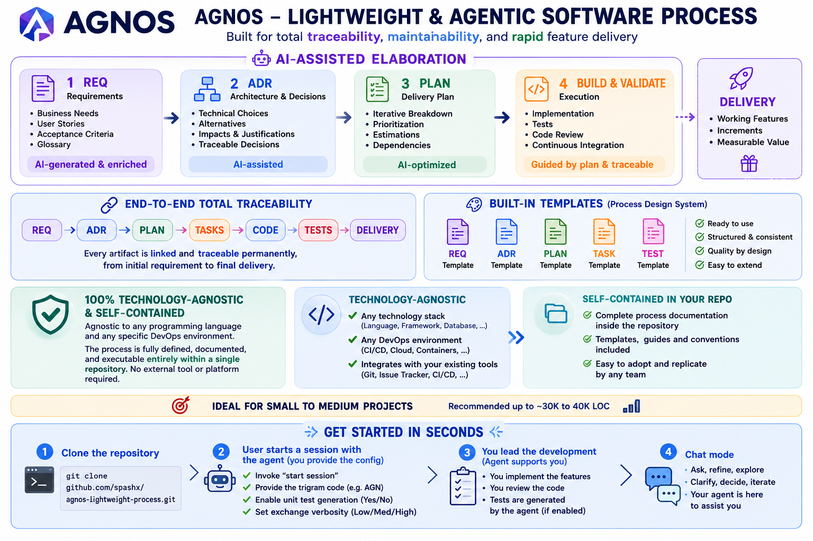

# AGNOS Software Engineering Process v3

<!-- README-VERSION: v3 - 2026-09-11T23:06:46Z -->

**AGNOS** is a lightweight, agentic AI-driven software engineering process designed for high traceability, maintainability, and rapid feature delivery. It enforces a clear workflow from requirements through architecture decisions to implementation, with version-controlled session state.



> This README orients a human reader. It is not normative and does not replace the instructions
> file — an AI agent executing the process reads
> [`.github/instructions/agnos-sw-eng.v3.instructions.md`](.github/instructions/agnos-sw-eng.v3.instructions.md),
> not this page.

## Supported Tools & Platforms

| | Supported |
|---|---|
| **AI coding tools** | GitHub Copilot (`.github/instructions/`, `.github/skills/`) and Claude Code (`CLAUDE.md`, `.claude/skills/`) — one canonical process, two entry points  |
| **Operating systems** | Windows (PowerShell), Linux / macOS (bash) — the git-workflow skill dispatches to the matching validator script  |

## Quick Start


> **New to AGNOS?** Read **[GETTING_STARTED.MD](GETTING_STARTED.MD)** first — one complete worked
> session, from branch creation to the closing report, showing what you type at each stage and what
> the agent produces in return.

Every session follows these steps:

1. **Load instructions** — Copilot auto-loads `.github/instructions/agnos-sw-eng.v3.instructions.md`; Claude Code auto-loads the root `CLAUDE.md`, which imports the same file
2. **Resolve session state** — Detect platform, ask user about unit tests and chat mode (`askQuestion` on Copilot, `AskUserQuestion` on Claude Code), write `session.yaml`
3. **Scan artifacts** — Check for open requirements, ADRs, and plans
4. **Create branch** — Use the `agnos-git-workflow` skill's `start-session <TRI>` sub-command
5. **Execute tasks** — Follow the plan, tier, and delivery checklist; Tier M/L tasks are test-first and record `Verification`/`Assumptions` evidence
6. **Commit with skill** — Use the `agnos-git-workflow` skill's `commit-task` sub-command — it computes the full Conventional-Commits message (type, scope, IDs) for you
7. **Close session** — Generate a summary report, including the session's process-friction metrics

## Folder Structure

```
process/
├── 1.requirements/          # FTR-* features and RQ-* requirements (EARS format)
├── 2.architecture/          # ADR-* architecture decision records (Mermaid diagrams required)
├── 3.plan/                  # PLAN-* plans and TASK-* tasks (Gherkin acceptance criteria)
└── _sessionstate/           # session.yaml (session variables) + METRICS_LOG.md (friction metrics), both version-controlled
```

## Key Concepts

### Artifact Identifiers

All artifacts follow `<TYPE>-<TRI>-<NNN>` format:
- `<TYPE>`: RQ (requirement), ADR (architecture), TASK (task), PLAN (plan), FTR (feature), DEC (decision)
- `<TRI>`: 3-letter uppercase trigram (e.g., USR, GIT, VAR)
- `<NNN>`: Zero-padded sequence (001, 002, ...)

**Example**: `RQ-USR-001`, `TASK-GIT-002`, `ADR-VAR-001`

### Core Workflow

| Phase | File | Format | Responsible |
|-------|------|--------|-------------|
| **Requirements** | FTR-*.md | EARS (Ubiquitous, Event-driven, State-driven, Unwanted-behavior) | Team |
| **Architecture** | ADR-*.md | Context → Decision → Consequences + Mermaid diagram | Team |
| **Planning** | PLAN-*.md, TASK-*.md | Gherkin acceptance criteria, tier (S/M/L) | AI Agent |
| **Implementation** | Code + tests | SOLID principles, no magic literals, traceable IDs | AI Agent |

### Session State Variables

Stored in `process/_sessionstate/session.yaml`, controlled at session start:

```yaml
unit_tests: true          # User variable: generate/run tests? (affects Testing section)
platform: windows         # System variable: detect OS (affects shell commands)
chat_mode: normal         # User variable: "normal" | "chat-eco" (affects chat verbosity)
```

**Guard syntax:**
- `WHILE session.unit_tests = false`: skip all Testing steps
- `ALWAYS use session.platform`: use platform-specific shell syntax
- `WHILE session.chat_mode = chat-eco`: keep all chat replies minimal (files and commits keep full rigor)

### Task Tiers

| Tier | Scope | Tests | ADR | Plan |
|------|-------|-------|-----|------|
| **S** | Edit ≤5 lines, no files, no API | No | No | No |
| **M** | New method/class/file, one module | Yes | No | No |
| **L** | Cross-cutting, new API, new dependency | Yes | Yes | Yes |

### Delivery Checklist (DoD)

All tasks must:
- ✓ Reference a requirement ID (S, M, L)
- ✓ Have no duplicated/magic literals (M, L)
- ✓ Pass tests (M, L)
- ✓ Compile without errors (S, M, L)

### Task Verification, Assumptions & Test-First

Every Tier M/L task carries two closure fields, filled in from real evidence produced in the
session — never from memory:
- **Verification**: the tool output (a re-run test, a re-read file, a command's exit code) that
  proves each acceptance criterion, cited before the task is marked Done.
- **Assumptions**: any detail the agent inferred under "infer and proceed" rather than one you
  gave explicitly, or `None`.

For Tier M/L tasks, the Gherkin-named test(s) are written **before** the production code they
target — a test written after the code risks describing what the code does instead of what it
must do.

### Process Friction Metrics

At session close, the agent reports 4 counters (AskUserQuestion invocations, Error Recovery
Protocol invocations, tasks re-tiered, Verification-caught discrepancies) and appends one row to
`process/_sessionstate/METRICS_LOG.md` — a small, version-controlled, cross-session log. If any
counter is non-zero, the agent proposes a follow-up improvement to the instructions file (a line
budget, 1-3 candidate themes, the resulting iteration count) and waits for your confirmation
before touching anything.

## Git Workflow

The **`agnos-git-workflow`** skill automates deterministic git operations, with the same canonical
procedure available from either tool:
- GitHub Copilot: `.github/skills/agnos-git-workflow/SKILL.md` (invoke via `/agnos-git-workflow`)
- Claude Code: `.claude/skills/agnos-git-workflow/SKILL.md` (thin pointer to the file above)

Sub-commands:
```
start-session <TRI>
commit-task <TASK> [<ADR>] <description>
```

Commit messages are Conventional-Commits — the skill infers `<type>` and parses `<TRI>` out of the
task ID, so you never type them yourself (see the skill's `commit-task` procedure for the exact
grammar):
- With ADR: `feat(USR): ADR-USR-001/TASK-USR-001 add login handler`
- Without ADR: `feat(USR): TASK-USR-002 add logout handler`
- During a recursive self-improvement session, an `Iteration: <k>/<N>` trailer is appended.

Artifact-ID validation runs a script chosen from `session.platform`:
- `windows` → `powershell -NoProfile -File .github/skills/agnos-git-workflow/scripts/validate-ids.ps1` (Windows PowerShell 5.1 — not `pwsh`)
- `linux` / `macos` → `bash .github/skills/agnos-git-workflow/scripts/validate-ids.sh`

Both scripts enforce identical `TRI`/`TASK`/`ADR` patterns and are kept exit-code-equivalent.

## Recursive Self-Improvement Sessions

A special session mode for evolving the instructions file itself, run as numbered iterations
(`1/N`, `2/N`, ...): one theme confirmed at a time, the 800-line budget tracked across the whole
effort rather than per iteration, an `Iteration: k/N` commit trailer, and a mandatory
semantic-conflict re-check before any new rule is proposed for approval. Triggered explicitly by
you — the agent never enters this mode on its own.

## Best Practices

### Before editing any file
Read the file in the current session first (Rule: "Read before editing").

### For shell commands
Check `session.platform` — use PowerShell on Windows, bash on macOS/Linux. Never use bash-only commands on Windows.

### For unit tests
WHILE `session.unit_tests = false`, skip all Testing section steps. If the variable is not in context, read `session.yaml` before proceeding.

### For traceability
Every artifact, every code file, every comment must reference its requirement ID. The user shall be able to `grep` any RQ-* ID and find all related code and docs.

## Adding New Variables

To add a new session variable:

1. Update the schema in the SESSION STATE VARIABLES section (keep existing keys)
2. Document its kind (user or system) and allowed values
3. Add the conditional guard(s) where it's used

Example: `debug_mode: false` (user variable, affects logging)

## File References

- **Worked example (start here)**: [GETTING_STARTED.MD](GETTING_STARTED.MD)
- **Full instructions**: [.github/instructions/agnos-sw-eng.v3.instructions.md](.github/instructions/agnos-sw-eng.v3.instructions.md)
- **Claude Code bridge**: [CLAUDE.md](CLAUDE.md)
- **Git workflow skill (canonical)**: [.github/skills/agnos-git-workflow/SKILL.md](.github/skills/agnos-git-workflow/SKILL.md)
- **Git workflow skill (Claude Code entry point)**: [.claude/skills/agnos-git-workflow/SKILL.md](.claude/skills/agnos-git-workflow/SKILL.md)

## Context Management

Long sessions degrade output quality. If you exceed 10 tasks in a session:
1. Generate a checkpoint summary in `process/3.plan/CHECKPOINT-<TRI>-<NNN>.md`
2. Start a new session with a reference to the checkpoint
3. Next session reads the checkpoint before proceeding

---

**Version**: v3
