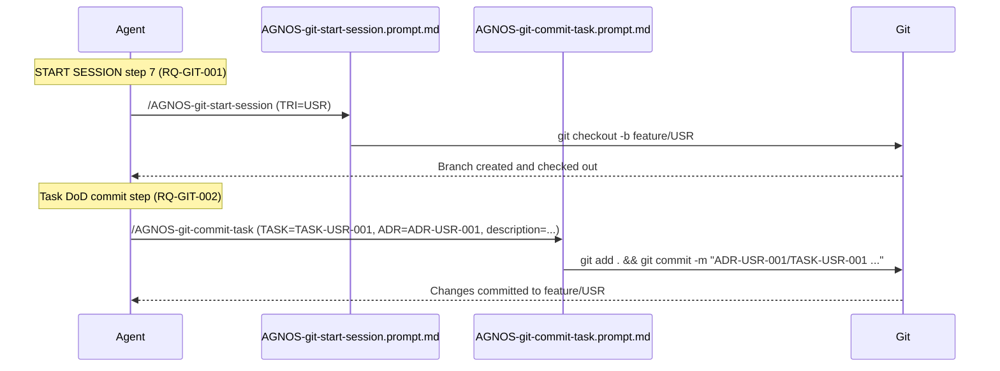

# ADR-GIT-001: Git Workflow Automation via Prompt Files

## Status
Superseded by ADR-GIT-002

## Context
The AGNOS process (RQ-GIT-001, RQ-GIT-002) mandates two specific GIT operations at defined
lifecycle points:

1. Creating a feature branch at session start (START SESSION step 7).
2. Committing task changes when a task is done (DoD commit step).

Both operations are single-focused, parameterized, and invoked on demand. They must be packaged
as reusable VS Code Copilot customizations that are discoverable via the `/` slash command
(RQ-GIT-005) and referenceable from the instruction process file (RQ-GIT-004).

The initial requirement description (REQ-git_skills.md) uses the term "skill", which in VS Code
Copilot terminology refers to a `SKILL.md` file — a multi-step workflow with bundled assets.
However, these two operations do not require bundled assets or multi-step coordination.

## Decision

**DEC-GIT-001**: ~~Implement both git operations as **`.prompt.md` files**~~ — *superseded by DEC-GIT-002*.

Files to create:
- `.github/prompts/AGNOS-git-start-session.prompt.md` — branch creation (RQ-GIT-001)
- `.github/prompts/AGNOS-git-commit-task.prompt.md` — task commit (RQ-GIT-002)

Rationale:
- `.prompt.md` is the correct VS Code Copilot primitive for single-focused, parameterized,
  on-demand tasks. Each operation is exactly "one prompt = one well-defined task."
- Prompts appear in the `/` slash command, directly satisfying RQ-GIT-005 (discoverability).
- `SKILL.md` files are designed for multi-step workflows with bundled assets; using them here
  would add unnecessary structure and complexity.
- `.github/prompts/` is workspace-scoped, so the prompts are shared with all team members and
  accessible to agentic workflows.

## Consequences
- Both prompts are invokable interactively via `/AGNOS-git-start-session` and `/AGNOS-git-commit-task`
  in Copilot Chat, or programmatically via `Chat: Run Prompt...`.
- The instruction process file can reference these prompts by name (RQ-GIT-004).
- No new external dependencies are introduced — standard VS Code Copilot feature.
- Future AGNOS git operations can follow the same `.prompt.md` pattern.
- Validation (RQ-GIT-003) is manual / interactive since prompt files are not executable code.

## Alternatives Considered

| Alternative | Reason Rejected |
|---|---|
| `SKILL.md` files | Designed for multi-step workflows with bundled assets; overkill for two simple parameterized operations. |
| `copilot-instructions.md` inline text | Non-reusable; not independently invokable as a slash command. |
| Git hooks (`.github/hooks/`) | Deterministic shell execution only; cannot prompt the user for input or handle branching logic interactively. |

## Diagram

