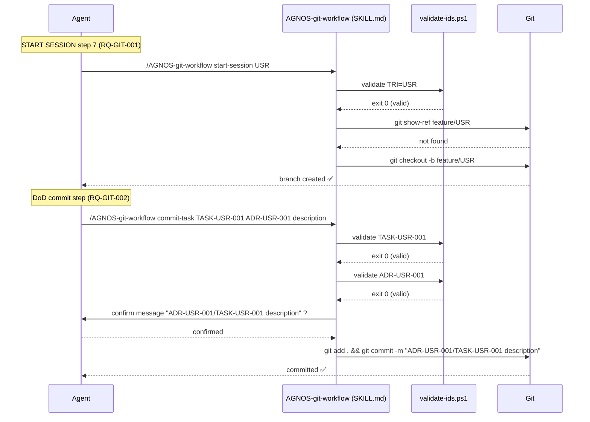

# ADR-GIT-002: Git Workflow as a Skill (supersedes ADR-GIT-001)

## Status
Accepted

## Context
ADR-GIT-001 (DEC-GIT-001) chose `.prompt.md` files for the two AGNOS git operations. While prompts
work and are slash-command-discoverable, they rely on AI reasoning for parameter validation and
git command construction — making them non-deterministic. Two issues were identified:

1. **No validation**: Artifact IDs (TRI, TASK-ID, ADR-ID) are only validated by the AI's
   interpretation of the instructions; malformed IDs can silently produce invalid commit messages.
2. **Fragmented interface**: Two separate prompts with no shared validation logic.

This matches current Gen AI software engineering practices where determinism and traceability
are enforced at the tool layer, not left to model reasoning.

## Decision

**DEC-GIT-002**: Replace the two individual `.prompt.md` files with a single **SKILL.md** at
`.github/skills/AGNOS-git-workflow/` that bundles:

- `SKILL.md` — agent instructions for both `start-session` and `commit-task` sub-commands
- `scripts/validate-ids.ps1` — PowerShell script that validates TRI, TASK, and ADR ID formats
  against regexes before any git command executes

The individual prompt files (`.github/prompts/AGNOS-git-start-session.prompt.md` and
`.github/prompts/AGNOS-git-commit-task.prompt.md`) are kept for backward compatibility but
superseded by the skill as the canonical entry point.

Invocation:
- `start-session`: `/AGNOS-git-workflow start-session <TRI>`
- `commit-task`: `/AGNOS-git-workflow commit-task <TASK-ID> [<ADR-ID>] <description>`

## Consequences
- ID format errors are caught by `validate-ids.ps1` (exit code) before any git state is mutated.
- Single slash command `/AGNOS-git-workflow` for all AGNOS git operations — lower cognitive load.
- The validation script can be tested independently and extended without touching the skill body.
- The skill body clearly documents both sub-commands, procedures, and expected behavior.
- Slightly more complex to maintain than a flat prompt file — acceptable given the validation benefit.

## Alternatives Considered

| Alternative | Reason Rejected |
|---|---|
| Keep `.prompt.md` (DEC-GIT-001) | Non-deterministic: ID validation depends on model reasoning, not code |
| Git hooks | No parameterization; execute automatically without user supervision |
| Two separate skills | Redundant setup; shared validation logic would be duplicated |

## Diagram

