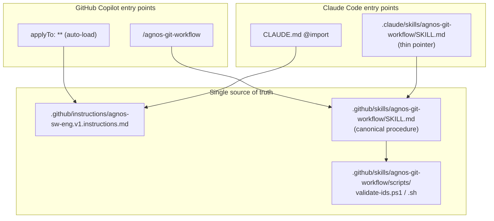

# ADR-PRT-001: Multi-Tool Bridge (GitHub Copilot + Claude Code) with a Single Source of Truth

## Status
Accepted

## Context
The AGNOS process (RQ-PRT-001, RQ-PRT-002, RQ-PRT-003, RQ-PRT-004) was authored for GitHub Copilot,
which auto-loads `.github/instructions/*.instructions.md` and reads skills from `.github/skills/`.
Claude Code uses different discovery mechanisms:

- It auto-loads **`CLAUDE.md`** from the repository root (and supports `@path` imports); it does
  **not** read `.github/instructions/`.
- It reads skills from **`.claude/skills/<name>/SKILL.md`**; it does **not** read `.github/skills/`,
  and it **rejects** skill names that are not lowercase-kebab (`^[a-z0-9]+(-[a-z0-9]+)*$`). The
  current `name: AGNOS-git-workflow` is therefore invalid.
- Its user-question tool is **`AskUserQuestion`**, not Copilot's `askQuestion`.

The constraint (RQ-PRT-004) is that the process text must not be duplicated: exactly one canonical
definition, referenced by each tool's entry point.

## Decision

**DEC-PRT-001 — Instruction bridge**: Add a root **`CLAUDE.md`** that `@import`s the canonical
instruction file `.github/instructions/agnos-sw-eng.v1.instructions.md`. `CLAUDE.md` contains only
the import plus a short "Tool mapping" note (question tool, skill location); it copies no process
prose. The instruction file remains the single canonical source for both tools.

**DEC-PRT-002 — Skill bridge with one canonical procedure**: Provide a Claude Code skill at
`.claude/skills/agnos-git-workflow/SKILL.md` whose `name` is the valid lowercase `agnos-git-workflow`
and whose `description` states when to use it and its two sub-commands. Its **body is a thin pointer**
that instructs the agent to read and follow the canonical procedure in
`.github/skills/agnos-git-workflow/SKILL.md`. The validation **scripts remain a single copy** under
`.github/skills/agnos-git-workflow/scripts/`, referenced by repo-root-relative path from either tool
(AGNOS git operations always run from the repo root). Result: one procedure doc, one script pair, two
thin tool-specific entry points.

**DEC-PRT-003 — Tool-neutral question reference**: Edit the canonical instruction file so every
"ask the user" step names the mechanism for both tools — `askQuestion` (Copilot) /
`AskUserQuestion` (Claude Code) — instead of the Copilot-only name.

## Consequences
- Claude Code loads the identical process automatically; no process prose is duplicated (RQ-PRT-004).
- The skill name becomes valid for Claude Code while staying invokable in Copilot (RQ-PRT-002).
- Two thin `SKILL.md` wrappers exist, but the executable procedure and scripts live once — drift is
  limited to frontmatter. The `.github` `SKILL.md` is the canonical procedure; the `.claude` one
  points to it.
- `CLAUDE.md` becomes a required, version-controlled bridge file at the repo root.
- Editing the question-tool wording touches the shared instruction file, so both tools update at once.

## Alternatives Considered

| Alternative | Reason Rejected |
|---|---|
| Copy the process text into `CLAUDE.md` | Violates RQ-PRT-004 (single source); guarantees drift. |
| Full-procedure copy in both `SKILL.md` files | Duplicates ~70 lines of procedure; drift risk with no offsetting benefit. |
| Symlink `.claude/skills` → `.github/skills` | Symlinks are unreliable across Windows/Git checkouts; also would not fix the invalid skill name. |
| Migrate fully to Claude Code (drop `.github`) | Loses GitHub Copilot support, which the team still uses. |

## Diagram

