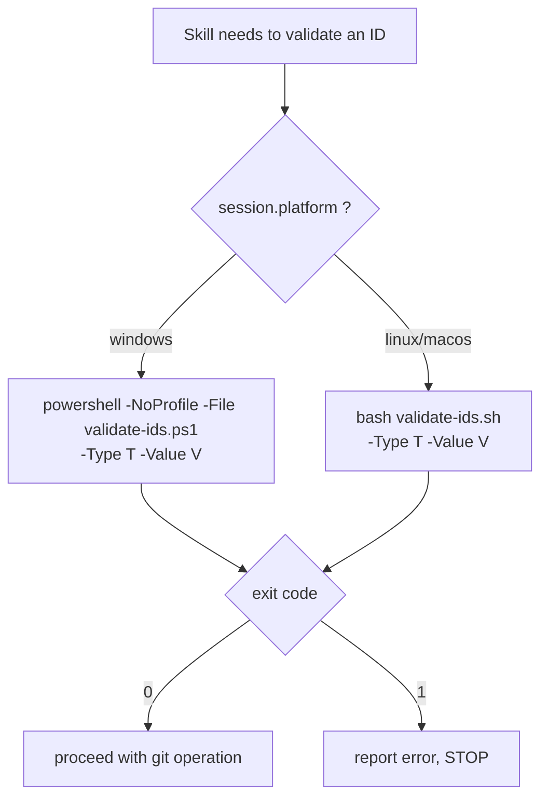

# ADR-PRT-002: Cross-Platform ID-Validation Scripts (dual PowerShell + bash)

## Status
Accepted

## Context
ADR-GIT-002 chose a script (`validate-ids.ps1`) to make artifact-ID validation deterministic at the
tool layer rather than relying on model reasoning. That intent is sound, but the current
implementation is not portable (RQ-PRT-005, RQ-PRT-006, RQ-PRT-007, RQ-PRT-008):

1. **`pwsh` is not guaranteed.** `SKILL.md` invokes `pwsh -NoProfile -File …`. Stock Windows ships
   only Windows PowerShell 5.1 (`powershell`); this workspace has **no `pwsh`**. The invocation
   fails as written even on Windows.
2. **PowerShell-only.** Stock Linux/macOS have no PowerShell at all, so the script cannot run there.
3. **Path casing bug.** `SKILL.md` references `.github/skills/AGNOS-git-workflow/scripts/…` while the
   on-disk folder is `agnos-git-workflow`. Case-insensitive Windows tolerates it; case-sensitive
   Linux does not.

The `platform` session variable (RQ-VAR-003) is already detected at session start, so the skill can
dispatch to the right script.

## Decision

**DEC-PRT-004 — Add a bash validator**: Create `validate-ids.sh` alongside `validate-ids.ps1`, both
under `.github/skills/agnos-git-workflow/scripts/`. It accepts the same `-Type {TRI|TASK|ADR}` and
`-Value <v>` arguments, enforces the same regexes, and follows the same exit-code contract (`0` ok,
`1` + stderr message on failure). The two scripts are kept regex-equivalent (RQ-PRT-008).

**DEC-PRT-005 — Platform-aware dispatch**: The skill selects the validator from `session.platform`:
- `windows` → `powershell -NoProfile -File .github/skills/agnos-git-workflow/scripts/validate-ids.ps1 -Type <T> -Value <V>`
- `linux` / `macos` → `bash .github/skills/agnos-git-workflow/scripts/validate-ids.sh -Type <T> -Value <V>`

Windows uses `powershell` (5.1, always present), **not** `pwsh`.

**DEC-PRT-006 — Fix path casing**: Every script path in the skill uses the exact on-disk casing
`agnos-git-workflow`.

## Consequences
- Validation runs on Windows, Linux, and macOS with no new runtime dependency (bash and Windows
  PowerShell are OS defaults).
- The deterministic-validation intent of ADR-GIT-002 is preserved and extended to all platforms.
- Two scripts must be kept in sync; RQ-PRT-008 defines the shared test vectors that prove equivalence.
- The bash script's argument parser must accept the PowerShell-style `-Type`/`-Value` flags so the
  skill's argument shape is identical on both platforms.

## Alternatives Considered

| Alternative | Reason Rejected |
|---|---|
| Single Python (or Node) validator | Adds a runtime dependency not guaranteed on either OS; heavier than a 20-line regex check. |
| Require `pwsh` (PowerShell 7) everywhere | Not installed by default on Windows or Linux; contradicts the observed environment. |
| Inline the regex checks in the skill prose | Reverts to model-reasoned validation — exactly what ADR-GIT-002 rejected. |
| Git Bash on Windows for the `.sh` | Not guaranteed present for all agents; Windows already has a working PowerShell path. |

## Diagram

