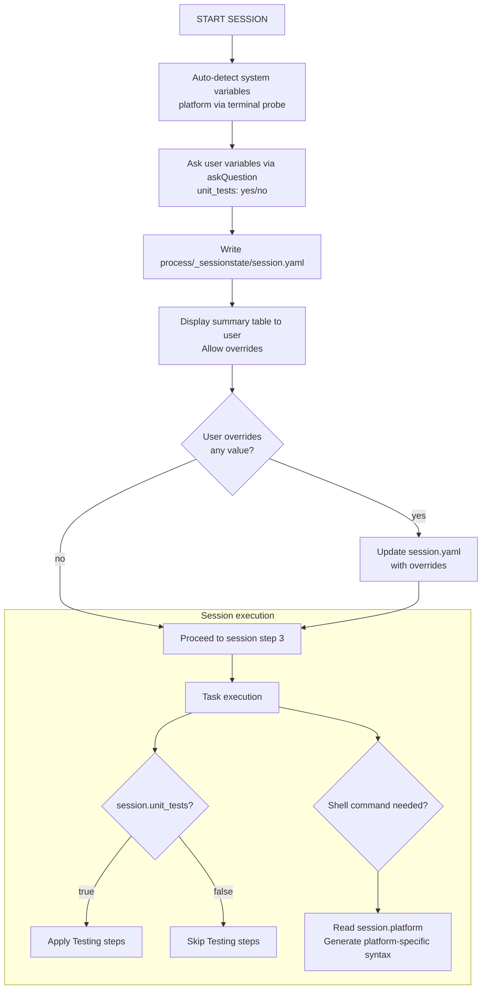

# ADR-VAR-001: Session State Variables Storage and Lifecycle

## Status
Proposed

## Context
RQ-VAR-001 through RQ-VAR-005 require the AGNOS process to support named variables that
conditionally control process execution. Two design questions arise:

1. **Where to persist state?** The agent's memory tooling (`/memories/session/`) is transient
   (cleared after the conversation). The requirement explicitly asks for version-controlled storage
   so past session configurations are auditable.

2. **How to structure the lifecycle?** Variables have two origins (user-asked vs. system-detected)
   and must both be resolved and confirmed by the user before the session proceeds.

## Decision

**DEC-VAR-001 — Storage**: Persist all session state in a single YAML file:
`process/_sessionstate/session.yaml`, tracked in git.

Rationale:
- Version-controlled: team members can diff session configs across branches (RQ-VAR-001).
- Single file: simple to read/write; no ambiguity about where state lives.
- YAML: human-readable, concise, and schema-documentable (RQ-VAR-005).
- Location under `process/` is consistent with the existing AGNOS folder convention.

**DEC-VAR-002 — Variable kinds and lifecycle**: Two kinds, resolved sequentially at START SESSION:

| Kind | Who resolves | Mechanism | Examples |
|------|-------------|-----------|---------|
| User variable | Agent asks via `askQuestion` | `askQuestion` at START SESSION | `unit_tests` |
| System variable | Agent auto-detects | Terminal command / environment probe | `platform` |

Lifecycle steps (inserted into START SESSION before step 3):
1. Auto-detect all **system variables** (e.g., `$PSVersionTable` / `uname` for platform).
2. Ask the user for all **user variables** via `askQuestion`.
3. Write resolved values to `process/_sessionstate/session.yaml`.
4. Display all values in a summary table; allow the user to override any value before proceeding.

**DEC-VAR-003 — Schema**: The YAML schema for `session.yaml`:

```yaml
unit_tests: true              # boolean — user variable (RQ-VAR-002)
platform: windows             # string: "windows" | "macos" | "linux" — system variable (RQ-VAR-003)
```

New variables follow the same flat key/value pattern; existing keys are never renamed.

**DEC-VAR-004 — Conditional execution**: The instruction process SHALL reference the session
state explicitly at each conditional step, using this syntax:

> `WHILE session.unit_tests = false, SKIP this step.`  
> `Use platform-specific syntax for session.platform.`

This makes the conditioning visible and grep-able in the instruction file.

## Consequences
- `process/_sessionstate/` must be added to the folder structure documentation.
- `.gitignore` must NOT exclude `process/_sessionstate/session.yaml` — it is intentionally tracked.
- START SESSION gains 4 new steps (variable resolution + confirmation); the numbering of existing steps shifts.
- Every conditional step in the instruction process gains an explicit `WHILE session.<var>` guard.
- The agent must re-read `session.yaml` only once at session start (after confirmation); it is immutable for the rest of the session.

## Alternatives Considered

| Alternative | Reason Rejected |
|---|---|
| `/memories/session/` (agent memory) | Transient — cleared after conversation; not version-controlled (violates RQ-VAR-001) |
| Inline in chat / system prompt | Not persistent; not auditable; not version-controlled |
| Per-variable files (`unit_tests.txt`, etc.) | Harder to read atomically; more files to manage |
| Environment variables | Not version-controlled; not portable across agents/IDEs |

## Diagram


