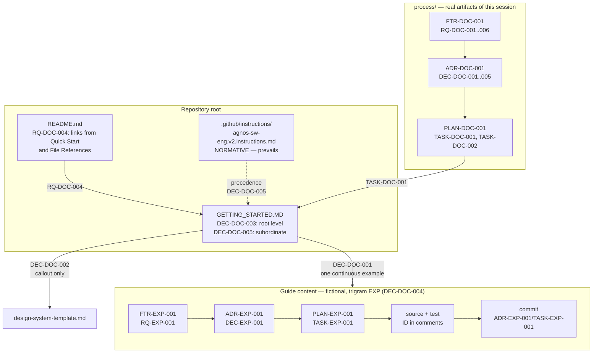

# ADR-DOC-001: Onboarding guide structure and placement

<!-- Motivated by: RQ-DOC-001, RQ-DOC-002, RQ-DOC-003, RQ-DOC-004, RQ-DOC-005, RQ-DOC-006 -->

## Status
Accepted

## Context

FTR-DOC-001 requires a walkthrough of one complete AGNOS session (RQ-DOC-001) that shows both the
human's prompts and the agent's artifacts (RQ-DOC-002), keeps one traceable example across all six
stages (RQ-DOC-003), stays discoverable from the README (RQ-DOC-004), and never becomes a second,
competing statement of the process (RQ-DOC-005).

Four forces have to be resolved before writing a single line:

1. **Example shape** — one continuous example, or an independent snippet per stage? Snippets are
   cheaper to write and to keep correct in isolation, but the thing a newcomer most needs to see is
   precisely what a snippet cannot show: the ID chain that binds a requirement to a commit.
2. **Example domain** — AGNOS mandates a design system before the first UI requirement is
   implemented (instruction section *MANDATORY DESIGN SYSTEM (UI PROJECTS)*). A UI example would
   therefore have to carry a token pipeline through every stage, roughly doubling the guide and
   burying the process mechanics under design-system mechanics.
3. **File placement** — the guide describes the process; it is not an output of a project run
   through the process. Putting it under `process/` would make it indistinguishable from real
   artifacts and would place a document with no requirement of its own next to documents whose
   defining property is having one.
4. **ID collision** — the example's IDs are printed in full and will be copied. If the example
   reused a trigram that real repository sessions use, `grep RQ-DOC-001` would return both the guide's
   fiction and the repository's actual requirement.

## Decision

**DEC-DOC-001 — One continuous worked example.** The guide follows a single example feature through
all six stages rather than presenting per-stage snippets. Every stage picks up the artifact IDs the
previous stage produced, so the traceability chain required by RQ-DOC-003 is visible as a narrative
rather than asserted as a rule.

**DEC-DOC-002 — Non-UI example domain, design system covered by callout.** The example is a
back-end feature (streaming CSV export of an order list). The design-system obligation for UI
projects is honoured by a dedicated callout section that states the rule and points at
`process/1.requirements/design-system-template.md`, instead of a second full walkthrough. Rationale:
force 2 above — the guide's subject is the process loop, and a UI example would make design-system
plumbing the dominant content.

**DEC-DOC-003 — Root-level `GETTING_STARTED.MD`, not a `process/` artifact.** The guide sits beside
`README.md` at the repository root. `process/` stays reserved for artifacts produced *by* the
process. The guide is nonetheless produced *through* the process — this ADR, FTR-DOC-001 and
PLAN-DOC-001 exist for exactly that reason — and carries its traceability as HTML comments in the
file header (instruction rule: references in comment form, never plain text).

**DEC-DOC-004 — Reserved example trigram `EXP`.** The guide's fictional artifacts use trigram `EXP`,
which is reserved for documentation examples and SHALL NOT be used by a real session in this
repository. This keeps `grep` results unambiguous, as required by the traceability rule.

**DEC-DOC-005 — Guide is subordinate to the instruction file.** The guide opens with an explicit
precedence statement: where guide and `.github/instructions/agnos-sw-eng.v2.instructions.md`
disagree, the instruction file prevails. Each stage section names the instruction section it
illustrates, so a drifted paragraph can be checked against its source in one hop (RQ-DOC-005).

## Consequences

**Easier**
- A newcomer sees the ID chain as a story, which is the only way the point of traceability lands.
- The guide can be reviewed for drift section by section, because each one names its source section.
- Example IDs can be copy-pasted into a real project with a search-and-replace of `EXP`.

**Harder**
- A continuous example is brittle: changing the example feature means rewriting every stage. This is
  accepted — the example is deliberately small enough that a rewrite is cheap.
- The design-system rule is stated but not demonstrated (DEC-DOC-002). A UI-project team gets the
  obligation and the template, not a worked token pipeline. If UI onboarding proves insufficient in
  practice, the answer is a separate `GETTING_STARTED-UI.MD` under a new ADR, not an expansion here.

**Constrained**
- Trigram `EXP` is burned for real use in this repository (DEC-DOC-004).
- Any future edit to the instruction file that changes a rule shown in the guide creates a
  documentation debt in the guide; RQ-DOC-005 makes that debt a defect rather than a matter of taste.

## Alternatives Considered

| Alternative | Why rejected |
|---|---|
| **Per-stage independent snippets** | Cheapest to maintain, and each snippet stays correct on its own — but it cannot show the requirement → ADR → task → code → commit chain, which is the single most important thing the guide has to teach (RQ-DOC-003). |
| **UI example (design system demonstrated end to end)** | Most faithful to a real product project, and would exercise the mandatory design-system rule. Rejected per force 2: the token pipeline would dominate the guide and obscure the process loop. Revisit as a separate guide if UI adoption stalls. |
| **Fold the walkthrough into `README.md`** | Zero discoverability problem, no second file to keep in sync. Rejected: the README is a reference sheet consulted repeatedly, the guide is a linear narrative read once — merging them makes the README hostile to both audiences. |
| **Guide as an artifact under `process/`** | Would make the guide subject to the same ID discipline as everything else. Rejected per force 3: `process/` holds artifacts produced by the process, and mixing meta-documentation in defeats a reader scanning that folder for open work. |
| **Reuse a live trigram for the example** | One less convention to remember. Rejected per force 4: it poisons `grep`, and `grep`-ability is the stated acceptance test of the traceability rule. |

## Diagram

