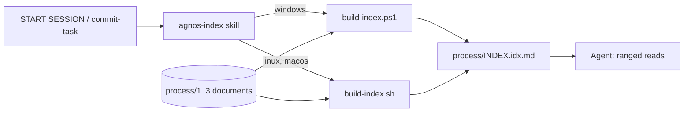

# ADR-IDX-001: Generated global process index

<!-- Motivated by: RQ-IDX-001 to RQ-IDX-017 (FTR-IDX-001) -->

## Status
Accepted

## Context
Finding an artifact by ID in large process documents costs many tokens. The agent needs a small,
always-correct map of where each FTR/RQ/ADR/DEC/PLAN/TASK is defined.

## Decision

### DEC-IDX-001: One global index, grouped by document
`process/INDEX.idx.md`, versioned in git: header, `#next` line, then `@<path>` per document followed
by rows `ID|first-last|status|title`. One read gives the whole inventory; path written once per
document; title last so it needs no escaping.

### DEC-IDX-002: Headings define artifacts, sections give ranges
A definition is an ATX heading, outside fenced code blocks, whose text starts with an ID. The range
ends before the next heading of same or higher level. Status comes from a `**Status**:` field or the
line after a `Status` heading. ADR decisions become `### DEC-<TRI>-<NNN>: <title>` headings.

### DEC-IDX-003: Full regeneration by a script, never by hand
One pass over all documents (as fast as any incremental mode, never stale), file rewritten only when
its content changes. Run at session start and by `commit-task` before staging.

### DEC-IDX-004: Two native scripts with byte-identical output
`build-index.ps1` (Windows PowerShell 5.1) and `build-index.sh` (bash + POSIX awk), dispatched on
`session.platform` like `agnos-git-workflow`. UTF-8 without BOM, LF, `/` paths, ordinal sort. Shared
test fixtures and expected files guarantee parity.

## Consequences
- One small read at session start, then ranged reads; duplicate IDs detected mechanically.
- Two implementations to keep in sync, guarded by the shared tests.
- Artifacts not declared as headings (e.g. older bold DEC paragraphs) are not indexed.

## Alternatives Considered
- One index per document: N reads and the right document must be known first.
- Path on every row: about a third more tokens on the full read.
- Single Python/Node implementation: runtime not guaranteed on user machines.
- Incremental update: detecting changes costs a full read anyway; mtimes are reset by git.

## Diagram

