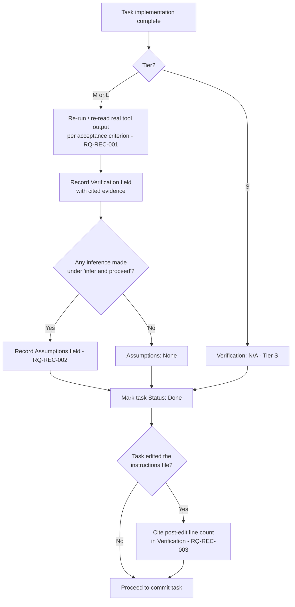

<!-- Iteration: 1/5 -->
# ADR-REC-001: Verification evidence and assumption logging in the DoD flow

<!-- Motivated by: RQ-REC-001, RQ-REC-002, RQ-REC-003 -->

## Status
Accepted

## Context
This repository's process file, `.github/instructions/agnos-sw-eng.v2.instructions.md`, is
normative for the AI agent executing it — and is now itself the subject of 5 recursive
self-improvement iterations. Two gaps matter immediately:

1. The existing "Self-check before declaring done" step (§3) asks the agent to verify the Delivery
   Checklist but does not require citing *evidence* — an agent can mark a criterion satisfied from
   memory of having done the work, which is exactly the overconfidence failure mode agentic coding
   assistants are prone to.
2. The existing "Infer and proceed" rule (§3, rule 4) is efficient but silent: nothing requires the
   inference itself to be written down, so a later reader cannot tell a deliberate decision from an
   unrecorded guess.
3. Because this and the next 4 iterations edit the same normative file, and the user has set a hard
   800-line ceiling on it (current size: 360 lines), that ceiling needs to be a tracked, measurable
   constraint from the first iteration on, not an afterthought in iteration 5.

**Assumptions**: None — all three constraints above were explicitly stated or agreed with the user
in this session before drafting this ADR.

## Decision

**DEC-REC-001 — Extend the TASK template and the DoD self-check rule with two fields: `Verification`
and `Assumptions`.** The TASK template (§3, Plan/Task File Template) gains two fields:
- `Verification`: for Tier M/L tasks, one line per acceptance criterion citing the concrete tool
  output that confirms it (a test run, a re-read file, a command's exit code). Tier S tasks may
  state `Verification: N/A (Tier S)`.
- `Assumptions`: any detail inferred under "infer and proceed" rather than explicitly given by the
  user, or the literal value `None`.

The "Self-check before declaring done" bullet in §3 is reworded to require populating
`Verification` from real, current-session tool output before the task's Status is set to Done —
not from recollection of an earlier pass.

**DEC-REC-002 — Track the instructions-file line budget manually as verification evidence, no new
tooling.** Any task that edits `agnos-sw-eng.v2.instructions.md` must report the file's post-edit
line count in its `Verification` field. No linter, pre-commit hook, or script is introduced in this
iteration: at 5 iterations total and one editor (the agent itself), a manual `wc -l` /
`Measure-Object -Line` check reported as evidence is sufficient and avoids building automation for a
one-off constraint (anti-pattern: no new abstraction for a one-off operation).

## Consequences

**Easier** — a reviewer (human or a later recursive iteration) can audit any Tier M/L task's closure
without re-deriving whether it actually worked; assumptions are visible instead of buried in agent
reasoning that isn't retained.

**Harder** — every Tier M/L task now carries two extra fields to fill in accurately; a task closed
without genuine re-verification (e.g., copy-pasting "N/A" out of habit) would look compliant while
defeating the intent — this is a discipline risk, not a tooling one, and is accepted as such.

**Constrained** — future iterations that edit the instructions file must budget their line growth
against RQ-REC-003's 800-line ceiling from the outset; a change that would exceed it must trim an
existing section in the same task rather than deferring cleanup to iteration 5.

## Alternatives Considered

| Alternative | Why rejected |
|---|---|
| **Independent verifier sub-agent re-checks every DoD** | Genuinely stronger guarantee, but disproportionate for a "lightweight process" (the process's own stated design goal) — doubles agent invocations for every Tier M/L task. Revisit only if self-reported `Verification` evidence proves unreliable in practice. |
| **New dedicated "Verification Log" file per task under `process/3.plan/`** | Adds a new artifact type and location outside the existing four-folder schema, and duplicates what the TASK file plus git history already record. Rejected for schema simplicity. |
| **Automated CI lint enforcing citation of tool evidence / line-count gate** | No CI infrastructure exists in this repository yet, and introducing one is out of scope for a documentation-only iteration. Reasonable to reconsider in a later iteration if manual discipline (DEC-REC-002) proves insufficient. |

## Diagram

