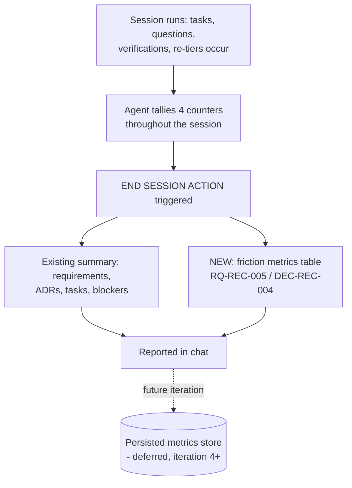

<!-- Iteration: 3/5 -->
# ADR-REC-003: Chat-only, fixed-format friction metrics (persistence deferred)

<!-- Motivated by: RQ-REC-005 -->

## Status
Accepted

## Context
The process now has two sources of friction signal thanks to iterations 1-2: `Verification`
catching real discrepancies (RQ-REC-001) and `Assumptions` recording silent inferences
(RQ-REC-002). Neither is aggregated anywhere — a reviewer must re-read every task in a session to
notice a pattern (e.g., three re-tiered tasks in one session, or repeated Error Recovery Protocol
triggers), which is exactly the kind of divergence between what was planned at DoR and what
actually happened by DoD that this recursive-improvement effort exists to surface.

**Assumptions**: None — the metric set and the chat-only scope were discussed and agreed with the
user before drafting.

## Decision

**DEC-REC-004 — Report four fixed counters as a table in the END SESSION ACTION chat summary; do
not persist them to a file in this iteration.** The counters are: AskUserQuestion invocations,
Error Recovery Protocol invocations, tasks re-tiered, and Verification-caught discrepancies. Using
a fixed set (rather than free-form prose) makes sessions comparable; keeping it chat-only avoids
committing to a persistence schema (per-session vs. cumulative, retention, format) before knowing
the counters are worth persisting.

## Consequences

**Easier** — a session's closeout report now surfaces friction patterns (e.g., "3 tasks re-tiered"
signals the tiering criteria may need revisiting) without re-reading every task.

**Harder** — none of substance: this is a reporting addition, not a new obligation during task
execution — the underlying events (AskUserQuestion, Error Recovery Protocol, re-tier, Verification
catch) already have to occur; only their count is now tallied.

**Constrained** — because the counters are chat-only, they do not survive past the session's chat
history; a user wanting a cross-session trend must read git/chat logs until a later iteration adds
persistence (see Alternatives).

## Alternatives Considered

| Alternative | Why rejected |
|---|---|
| **Persist counters now** (e.g. `process/_sessionstate/metrics.yaml`, cumulative across sessions) | The stronger long-term answer — enables real trend analysis — but requires deciding a schema (reset per session? rolling window?) before a single session's worth of data has validated the four counters are the right ones. Deferred to iteration 4 as a natural follow-on if iteration 3's reporting proves useful. |
| **Free-form prose metrics** (no fixed counter set) | Cheapest, but non-comparable across sessions — defeats the divergence-detection purpose RQ-REC-005 exists for. |
| **Per-task metrics instead of per-session aggregation** | Too granular for a lightweight process; session-level matches the existing END SESSION ACTION cadence and keeps the report short. |

## Diagram

