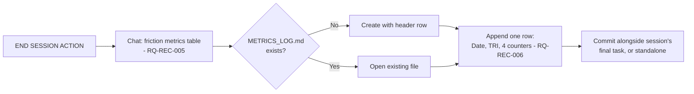

<!-- Iteration: 4/5 -->
# ADR-REC-004: Single append-only Markdown log for cross-session metrics

<!-- Motivated by: RQ-REC-006 -->

## Status
Accepted

## Context
RQ-REC-005 (iteration 3) reports friction counters in chat, deliberately deferring persistence
until the idea proved useful (ADR-REC-003). It has: the counters are a fixed, comparable set, and
the user confirmed cross-session trend visibility is the actual goal (spotting a pre-/post-mortem
divergence). A persistence mechanism is needed that stays consistent with the process's existing
conventions — flat, version-controlled, human-readable, grep/diff-friendly — rather than
introducing new tooling.

**Assumptions**: None — scope (one log file, per-session granularity, no new tooling) was agreed
with the user before drafting.

## Decision

**DEC-REC-005 — One running Markdown table, `process/_sessionstate/METRICS_LOG.md`, one row
appended per session.** Columns: `Date`, `TRI`, `AskUserQuestion`, `ErrorRecovery`, `ReTiered`,
`VerificationCatches` — mirroring RQ-REC-005's four counters plus the two identifiers needed to
place a row in context. The file is created with its header row on first use and is version
controlled like `session.yaml`.

## Consequences

**Easier** — `git log -p -- process/_sessionstate/METRICS_LOG.md` gives an instant history of
process friction over time; no new file format or parser to introduce, since it's a table any
Markdown viewer (and the agent) already reads.

**Harder** — none of substance: appending one row is a single Edit per session close, no different
in effort from the chat report it mirrors.

**Constrained** — the log's columns are fixed to RQ-REC-005's four counters; adding a fifth counter
later requires updating both the chat-report rule and this log's header in the same change, so they
never drift apart.

## Alternatives Considered

| Alternative | Why rejected |
|---|---|
| **One file per session** (`process/_sessionstate/metrics/<date>-<TRI>.md`) | Scales to many small files for what is, at this stage, a handful of rows; a single table is easier to eyeball for a trend at a glance. Reconsider only if the log grows unwieldy. |
| **YAML array in a new file** | No reader advantage over a Markdown table for this repo's conventions (every other artifact is Markdown), and loses the free git-diff-per-row readability of an append-only table. |
| **Append to `session.yaml`** | `session.yaml` is documented as the single source of truth for *the current session* (overwritten each session start); growing it into a cross-session list would break that existing, already-relied-upon semantic. |

## Diagram

