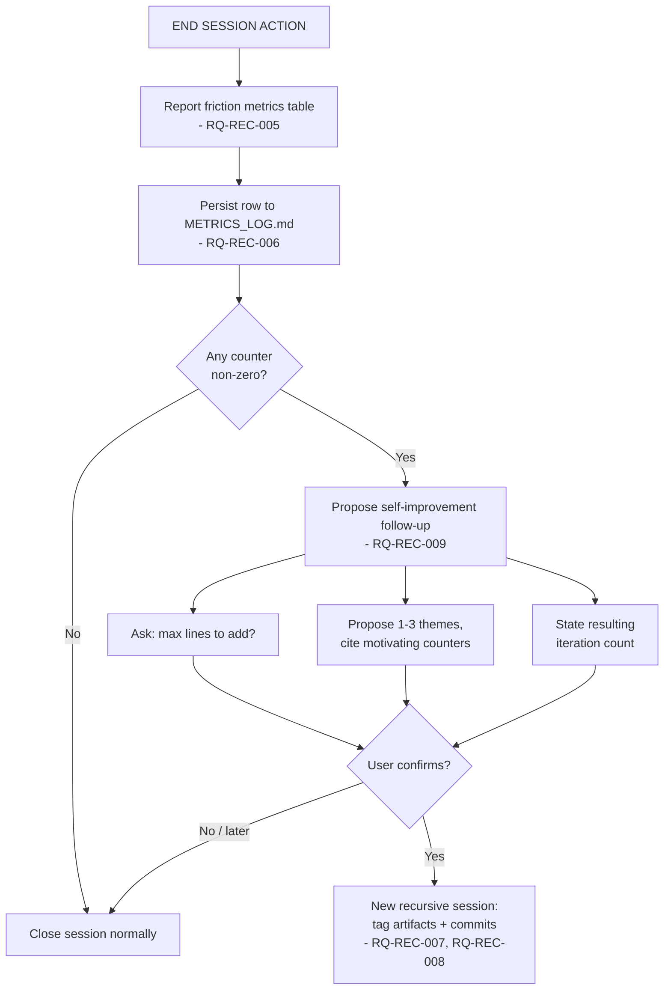

<!-- Iteration: 5/5 -->
# ADR-REC-005: Formalized recursion conventions and a proactive close-the-loop trigger

<!-- Motivated by: RQ-REC-007, RQ-REC-008, RQ-REC-009, RQ-REC-010 -->

## Status
Accepted

## Context
Iterations 1-4 built the raw material for a self-sustaining improvement loop: `Verification` and
`Assumptions` fields that surface real discrepancies (RQ-REC-001/002), test-first discipline
(RQ-REC-004), and friction metrics reported and persisted at session close (RQ-REC-005/006). Two
things are still missing: (1) the tagging/commit conventions that made this session's own iterations
traceable were never written down, only agreed in chat; (2) nothing turns the collected metrics into
an actual next action — a debrief that stops at reporting numbers does not, by itself, improve
anything, which is the specific gap the user pointed out.

**Assumptions**: None — this final iteration's scope (formalize conventions + close the loop with a
proactive proposal) was explicitly confirmed by the user before drafting.

## Decision

**DEC-REC-006 — Iteration tag as a first-line comment.** `<!-- Iteration: <k>/<N> -->` on the first
line of any artifact touched during a numbered recursive self-improvement session, exactly as
practiced in iterations 1-4.

**DEC-REC-007 — Conventional-Commits prefix + trailer on top of the existing commit-task format.**
`<type>(<TRI>): <ADR>/<TASK> <description>` with an `Iteration: <k>/<N>` trailer, layered on the
pre-existing `<ADR>/<TASK> <description>` mechanic (RQ-GIT-002) rather than replacing it — the
`agnos-git-workflow` SKILL.md is updated to describe this as the format to use specifically during
such sessions, keeping the general-purpose default format unchanged for ordinary tasks.

**DEC-REC-008 — Trigger the self-improvement proposal on any non-zero friction counter, no
threshold.** Whenever RQ-REC-005's metrics table has at least one non-zero value, END SESSION
ACTION proposes a follow-up: ask for a line-count budget, present 1-3 themes tied to the specific
counter(s) observed, and state the resulting iteration count. No numeric threshold gates this in
iteration 5 — consistent with how iteration 3 (DEC-REC-004) deferred metrics *persistence* until
proven useful rather than guessing a schema upfront; here we defer a *threshold* until we have
sessions' worth of data to calibrate one against false positives.

**DEC-REC-009 — Reuse the START SESSION semantic-conflict check mid-iteration, explicitly framed as
complementary rather than sufficient.** Before presenting a candidate rule for DoR approval during
a recursive self-improvement iteration, the agent re-applies the same conflict check §START SESSION
ACTION step 7 already mandates once at session start. This raised directly by the user in response
to a question about how self-improvement quality is controlled: the answer is that it mostly is not
— by design, human review at the theme and DoR gates is the real safeguard — and this check only
adds a narrow, mechanical net for outright contradictions, not a judgment of whether a rule is
useful or aligned with the file's stated purpose.

## Consequences

**Easier** — a future session that wants to run "N more self-improvement iterations" inherits the
conventions instead of re-deriving them in conversation; a session with observed friction gets an
actionable proposal instead of a number nobody reads twice.

**Harder** — every session close now carries a conditional extra step (checking the metrics table
for non-zero values); this is a single comparison, not meaningfully more effort.

**Constrained** — the proposal step is descriptive, not prescriptive: it must present themes and
ask for a line budget, but SHALL NOT itself start implementing without explicit user confirmation —
consistent with the existing DoR gate (§3) that governs all task starts.

## Alternatives Considered

| Alternative | Why rejected |
|---|---|
| **Numeric threshold per counter before proposing** (e.g. only propose if ReTiered ≥ 2) | Reasonable eventually, but no session data exists yet to calibrate a sensible threshold; a threshold picked blind risks suppressing a real signal on the very first session it would matter. Revisit once METRICS_LOG.md (RQ-REC-006) has accumulated more than a couple of rows. |
| **Always propose regardless of metrics** | Simpler, but noisy — a session with zero friction would still get a proposal, training the user to ignore it. |
| **Replace the existing commit-task format instead of layering the conventional-commit prefix on top** | Would break RQ-GIT-002's existing, already-relied-upon `<ADR>/<TASK> <description>` contract for every non-recursive-session task; layering keeps backward compatibility. |
| **No mid-iteration conflict check (status quo)** | Leaves exactly the gap the user identified: a new rule could silently contradict an existing one until some future session's START SESSION scan — or a human — happens to notice. |

## Diagram

